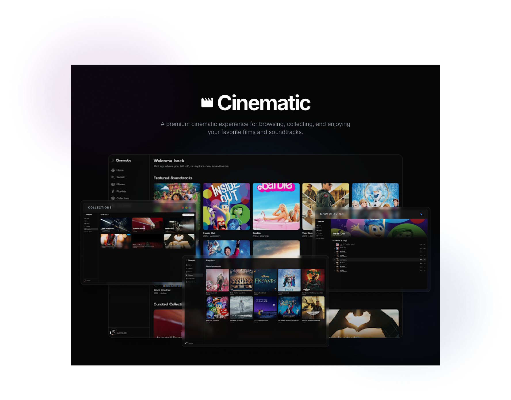

# Cinematic 🎬🎵

<p align="center">
  
</p>

> **Cinematic** is a premium, feature-rich web application designed for movie soundtrack enthusiasts. It integrates rich movie metadata from the **TMDB API** and high-quality, playable 30-second soundtrack previews from the **Deezer API** to provide an immersive listening experience. 

Built with **Next.js 16 (App Router)**, **React 19**, **Supabase SSR**, and **Clerk Auth**, Cinematic features a full-fledged audio player, custom collection creation, library tracking, and modern responsive styling.

---

## 🌟 Features

- 🍿 **Soundtrack Explorer**: Browse movies with detailed metadata (title, overview, poster art, release year, and genre).
- 🎵 **Integrated Audio Player**: Play 30-second previews of iconic movie tracks with a persistent, rich controls bar (Play/Pause, Skip Forward/Backward, Shuffle, Repeat, Volume adjustment) powered by **Howler.js**.
- 📂 **Curated & Custom Collections**: Organize tracks into curated film-genre collections or create your own custom playlists.
- 👤 **Secure User Management**: Full Clerk authentication integration featuring customized sign-in, sign-up modals, and auth-protected routes.
- 🗂 **User Library**: A unified space to track liked songs, saved playlists, and automatically updated "Recently Played" history.
- 🎨 **Rich Dark/Light Aesthetics**: Optimized dark mode experience, smooth glassmorphism, responsive grid layouts, and micro-animations styled with **Tailwind CSS v4** and **Shadcn UI**.

---

## 🛠 Tech Stack

- **Framework**: [Next.js 16 (App Router)](https://nextjs.org/) & [React 19](https://react.dev/)
- **Language**: [TypeScript](https://www.typescriptlang.org/)
- **Authentication**: [Clerk](https://clerk.com/)
- **Database & Backend**: [Supabase](https://supabase.com/) (using PostgreSQL, `@supabase/ssr` client, and DB triggers)
- **Audio Engine**: [Howler.js](https://howlerjs.com/)
- **State Management**: [Zustand](https://zustand-demo.pmnd.rs/) (Client-side player state) & [React Query](https://tanstack.com/query)
- **Styling**: [Tailwind CSS v4](https://tailwindcss.com/), [Shadcn UI](https://ui.shadcn.com/), and [Lucide React](https://lucide.dev/) (for icons)

---

## 📂 Project Architecture

```bash
├── public/                 # Static assets (icons, SVGs, and cover_image.png)
├── src/
│   ├── app/                # Next.js App Router folders
│   │   ├── (auth)/         # Authentication routing (sign-in / sign-up)
│   │   ├── (dashboard)/    # Auth-protected pages (discover, library, search, etc.)
│   │   ├── api/            # API endpoints & Clerk Webhooks
│   │   ├── globals.css     # Global stylesheets and Tailwind configuration
│   │   └── layout.tsx      # Main wrapper layout
│   ├── components/         # Modular, reusable UI components
│   │   ├── home/           # Landing page elements (Hero, Curated Collections)
│   │   ├── layout/         # Navigation bars & sidebar UI
│   │   ├── music/          # Movie, Collection, and Playlist cards/rows
│   │   ├── player/         # AudioPlayer wrapper & playback controls
│   │   └── ui/             # Shadcn base primitives
│   ├── lib/                # Shared utilities & configurations
│   │   ├── hooks/          # Custom React Hooks
│   │   ├── stores/         # Zustand store definitions (audio playback)
│   │   ├── supabase/       # SSR-ready Supabase Client & Server initializers
│   │   └── types/          # Core TypeScript Interfaces (User, Movie, Song, etc.)
│   └── middleware.ts       # Clerk Auth route protection middleware
├── seed.mjs                # Data injection script using TMDB and Deezer APIs
├── tsconfig.json           # TypeScript configuration
└── package.json            # Dependencies and scripts
```

---

## 📊 Database Schema & Triggers

Cinematic leverages Supabase (PostgreSQL) for relational data storage:

1. **`users`**: Manages user details synchronized via a Clerk Webhook (ID, Clerk ID, Email, Name, Avatar URL).
2. **`movies`**: Stores curated movies (ID, Title, Description, Cover URL, Release Year, Genre).
3. **`songs`**: Tracks individual movie songs containing a Deezer 30-second `audio_url`.
4. **`playlists`**: Supports grouping of songs (either `'movie'` for official soundtracks, `'favorites'` for liked songs, or `'custom'` for user playlists).
5. **`playlist_songs`**: A junction table mapping songs to playlists.
6. **`collections`**: Groupings of playlists (e.g., themed categories).
7. **`collection_playlists`**: Junction table mapping collections to playlists.
8. **`recently_played`**: Tracks user playback history chronologically.

### Automatic Playlist Creation
The database includes PostgreSQL triggers:
- **`after_movie_insert`**: Automatically creates a soundtrack playlist row for each new movie inserted.
- **`after_song_insert`**: Automatically links newly inserted songs to their corresponding movie playlist.

---

## ⚙️ Getting Started

### 1. Prerequisites
Make sure you have:
- [Node.js](https://nodejs.org/) (v20+ recommended)
- A [Supabase](https://supabase.com/) project set up
- A [Clerk](https://clerk.com/) application configured
- A [TMDB API Key](https://www.themoviedb.org/documentation/api)

### 2. Environment Configuration
Create a `.env.local` file in the root directory and copy/paste your keys:

```ini
# Clerk Authentication Configuration
NEXT_PUBLIC_CLERK_PUBLISHABLE_KEY=your_clerk_publishable_key
CLERK_SECRET_KEY=your_clerk_secret_key
CLERK_WEBHOOK_SECRET=your_clerk_webhook_secret

# Clerk Authentication Redirection URLs
NEXT_PUBLIC_CLERK_SIGN_IN_URL=/sign-in
NEXT_PUBLIC_CLERK_SIGN_UP_URL=/sign-up
NEXT_PUBLIC_CLERK_AFTER_SIGN_IN_URL=/dashboard
NEXT_PUBLIC_CLERK_AFTER_SIGN_UP_URL=/dashboard

# Supabase Backend Configuration
NEXT_PUBLIC_SUPABASE_URL=your_supabase_url
NEXT_PUBLIC_SUPABASE_ANON_KEY=your_supabase_anon_key
SUPABASE_SERVICE_ROLE_KEY=your_supabase_service_role_key

# Third-party APIs
TMDB_API_KEY=your_tmdb_api_key
```

### 3. Setup and Run

1. **Clone the repository**:
   ```bash
   git clone https://github.com/your-username/movie-music-app.git
   cd movie-music-app
   ```

2. **Install dependencies**:
   ```bash
   npm install
   ```

3. **Seed the database**:
   Run the seeding script to populate the Supabase DB with movie and soundtrack metadata. Node 20+ allows loading the environment variables directly:
   ```bash
   node --env-file=.env.local seed.mjs
   ```

4. **Start the development server**:
   ```bash
   npm run dev
   ```
   Open [http://localhost:3000](http://localhost:3000) in your browser to view the application!

---

## 🚀 Key Scripts

- `npm run dev`: Runs the Next.js development server.
- `npm run build`: Generates the production bundle.
- `npm run start`: Runs the Next.js production build server.
- `npm run lint`: Analyzes code quality using ESLint and automatically fixes formatting issues.

---

## 🤝 Contributing

Contributions are welcome! If you'd like to help improve Cinematic:
1. Fork this repository.
2. Create your feature branch (`git checkout -b feature/amazing-feature`).
3. Commit your changes (`git commit -m 'Add some amazing feature'`).
4. Push to the branch (`git push origin feature/amazing-feature`).
5. Open a Pull Request.

---

## 📄 License

This project is licensed under the [MIT License](LICENSE).
